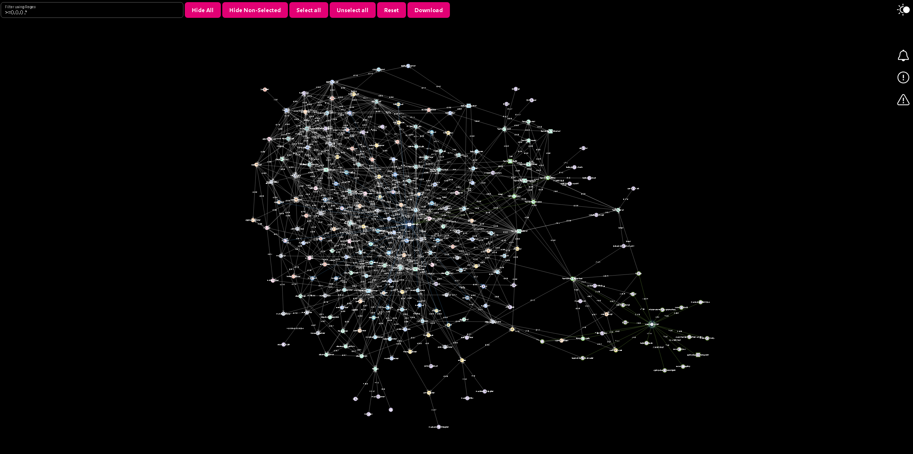
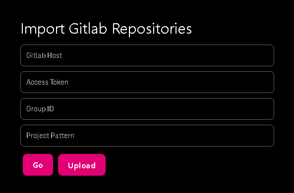

# dependency-graph

[GitHub-Pages](https://ron96g.github.io/dependency-graph/)

Small side project to display a pom dependency tree in gitlab as a network graph.

    

# Features
The GUI should have the most important features to navigate, select, filter and handle the data. 

## Import

    

- You can import projects from Gitlab Group and their POM structure.
They will then be parsed and are used as nodes and edges in the graph. 

- You can upload the exported graph and it will re-render.

## Filtering and Selection
Using the `Filter using Regex` button in the top left corner you can use enhanced filtering and selection of nodes and edges by
- version, e.g. `>=1.2.3` and other operations `"==", "!=", "=!", "=>", ">=", "<=", "=<", ">", "<"`
- name using regex, e.g. `.*(module-a|module-b|module-c).*`

You can also select specific nodes or edges. These and all associated items will be highlighted.
- Green means that the nodes depends on the associated node
- Blue means that the node is a dependency of the associated node

> All edges are directional and all items have mouseover descriptions

Using the other buttons you can further customize the selection.

## Export and Download
You can both export the json-data and also a picture of the graph. The exported data can then be uploaded again to re-render the graph.

## Persistence
The graph is written to the local browser storage and thus persisted after exit of the site. This can be undone by clicking the `Reset` button.

# TODOs
   
- Filter/Highlight nodes which have multiple versions of a module
- Popup notifications, warnings, errors
- Show summary to selected nodes